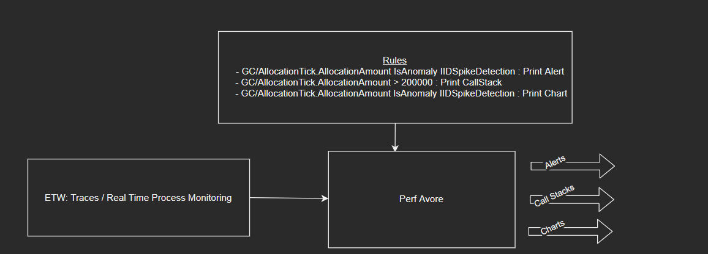
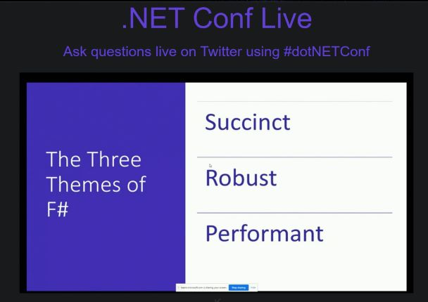
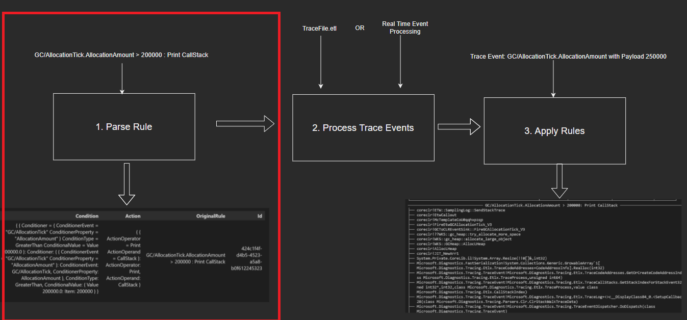
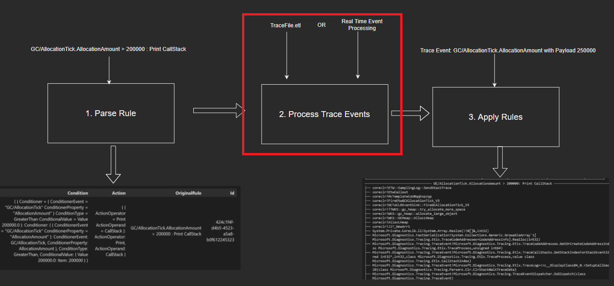
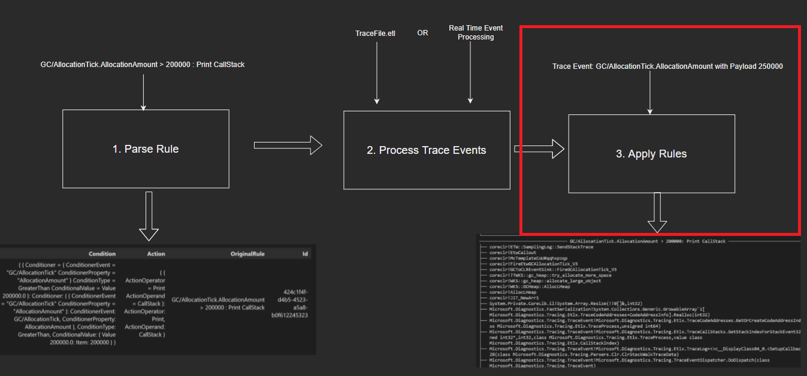

# Perf Avore: A Performance Analysis and Monitoring Tool in FSharp

For my 2021 F# Advent Submission (5 years of submissions!!!!), I developed a Performance Based Monitoring and Analysis Tool called "_Perf-Avore_" that applies user specified __Rules__ that consists of __Conditions__ to match based on Trace Events from either an .ETL trace or a real time session and if the conditions are met, __Actions__ specified in the rule are invoked. The types of __Conditions__ could include to check if the trace event property is an anomaly i.e. a deviant point based on an anomaly detection algorithm or is simply above a threshold value specified in the rule. Similarly, types of __Actions__ could be specified that lead to different outputs such as printing out the callstacks, charting the data point or just simply alerting the user that a condition is met.  

The __purpose__ of Perf Avore is to provide users an easy and configurable way to detect and diagnose performance issues effectively by specifying details that are pertinent to performance issues in the rule itself. A use case, for example, is detecting spikes in memory allocations that can put unwanted pressure on the Garbage Collector and inevitably slow down the process. By specifying a rule that tracks ``AllocationAmount`` on the ``GC/AllocationTick`` event if it goes above a specified amount and then printing out the callstack for it can shed light on the impetus behind the increased pressure.

## High Level Overview



1. Users provide rules.
   1. Rules consist of conditions and actions.
   2. Conditions Include: 
      1. The Name of the Trace Event and the property they'd like to track. 
      2. The condition or case for which they'd like to act on.
2. Trace Events are proffered to the rules engine to apply the rules to.
3. Based on either a given trace or by real time monitoring, conditions are checked for and actions are invoked based on a stream of trace events.
4. Examples of Rules:
   1. ``GC/AllocationTick.AllocationAmount > 200000 : Print Alert``
   2. ``ThreadPoolWorkerThreadAdjustment/Stats.Throughput < 4 : Print CallStack``
   3. ``GC/HeapStats.GenerationSize0 isAnomaly DetectIIDSpike : Print Chart``

The code is available [here](https://github.com/MokoSan/FSharpAdvent_2021/tree/main/src/PerfAvore/PerfAvore.Console). 

To 

1. Directly jump into the details without reading about the experience developing in FSharp and the motivation, click [here](https://nbviewer.org/github/MokoSan/PerfAvore/blob/main/AdventSubmission.ipynb#Plan).
2. Start learning how to run Perf Avore click [here](https://nbviewer.org/github/MokoSan/PerfAvore/blob/main/AdventSubmission.ipynb#How-To-Run-Perf-Avore). 

## Experience Developing in FSharp 

F#, once again, didn't fail to deliver an incredible development experience! 
Despite not developing in F# for an extended period of time (much to my regret - I kicked myself about this during last year's [submission](https://bit.ly/3hhhRjq) as well), I was able to let the muscle memory from my previous projects kick in and reached a productive state surprisingly quickly; I'd like to underscore that this is more of a testament to the ease of usage of the language speaking volumes about the user-friendly nature of the language itself (and not necessarily my some-what-sophomoric acumen). 

Granted, I didn't make use of all the bells and whistles the language had to offer, what I did make use of was incredibly easy to get stuff done with. 
The particular aspects of the language that made it easy to develop a Domain Specific Language, a parser for that domain specific language and dynamic application of the actions are Pattern Matching and Immutable Functional Data Structures such as Records and Discriminated Unions that make expressing the domain succinctly and lucidly not only for the developer but also the reader.

An image that typifies the incredibly accessible nature of F# is the following one filched from a presentation by [Don Syme](https://twitter.com/dsymetweets) and [Kathleen Dollard](https://twitter.com/KathleenDollard) during this year's .NET Conf in November:



## Inspiration For the Project

Perf Avore was heavily inspired by [maoni0's](https://twitter.com/maoni0) [realmon](https://github.com/Maoni0/realmon), a monitoring tool that tells you when GCs happen in a process and some characteristics about these GCs. My contributions and associated interactions for realmon definitely were incredibly instrumental in coming up with this idea and it's implementation.

Additionally, as a Perf Engineer, I find that there are times where I need to arduously load traces in Perf View, resolve symbols and wait until all the windows open up to do basic things such as look up a single call stack for a single event or look up the payload value of a single event. By devising a simpler solution, I wish to reduce my perf investigation time as I build on this project.

## 5 Years Going Strong!

It has been 5 years of submissions to the FSharp Advent event and it has been an awesome experience. Here are links to my previous posts:

1. [2020: Bayesian Inference in F#](https://bit.ly/3hhhRjq)
2. [2019: Building A Simple Recommendation System in F#](http://t.co/KqE8kfaZQ7)
3. [2018: An Introduction to Probabilistic Programming in F#](https://t.co/fdssLnvzLX)
4. 2017: The Lord of The Rings: An F# Approach
   1. [Introduction](https://t.co/8qGEiwNniY)
   2. [The Path of the Hobbits](https://t.co/UtFQRj3W3X)
   3. [The Path of the Wizard](https://t.co/6AzIg7voAb)
   4. [The Path of the King](https://t.co/ko6bubJqsw)

Now that a basic overview and other auxiliary topics have been covered, without much more ceremony, I'll be diving into how I built Perf Avore. 

## Plan

The plan to get rule applications working is threefold:

1. __Parse Rules__: Convert the user inputted string based rules to a domain defined Rule.
2. __Process Trace Events__: Retrieve trace events from either a trace or a real time process.
3. __Apply Rules__: If the conditions of a rule are met, invoke the action associated with the rule.


However, before implementation is presented, it is of paramount importance to define the domain.

## The Domain

A Rule is defined as having a __Condition__ and an __Action__. 

``GC/AllocationTick.AllocationAmount > 200000 : Print Alert``

Here, the user requests that for the said process, an alert will be printed if the ``AllocationAmount`` of the ``GC/AllocationTick`` event is greater than 200,000 bytes. The action if the condition is met is that of alerting the user by outputting a message. 

A rule, more generally, is of the following format: 

``EventName.PropertyName ConditionalOperator ConditionalOperand : ActionOperator ActionOperand``

where:

| Part | Description | 
| ----------- | ----------- |
| Event Name | The event name from the trace / real time analysis for which we want to look up the property. | 
| Property Name | A double property (this may change in the future) for which we'd want to construct a rule for. | 
| Conditional Operator | An operator that, along with the Conditional Operand, will dictate situation for which we'll invoke an action for. |   
| Conditional Operand | The value or name of the anomaly detection operator along with the Conditional Operator that'll dictate the situation for which we'll invoke an action for. | 
| Action Operator | The operator that, along with the action operand will be invoked if a condition is met. |  
| Action Operand | The operand for which the action operator will be applied to in case a condition is met. | 

The __Condition__ is modeled as the following combination of records and discriminated unions:


```F#
// src/PerfAvore/PerfAvore.Console/RulesEngine/Domain.fs

type Condition = 
    {  Conditioner      : Conditioner
       ConditionType    : ConditionType
       ConditionalValue : ConditionalValue }
and Conditioner = 
    { ConditionerEvent    : ConditionerEvent 
      ConditionerProperty : ConditionerProperty }
and ConditionType = 
    | LessThan
    | LessThanEqualTo
    | GreaterThan
    | GreaterThanEqualTo
    | Equal
    | NotEqual
    | IsAnomaly
and ConditionalValue =
    | Value of double
    | AnomalyDetectionType of AnomalyDetectionType 
and ConditionerEvent    = string
and ConditionerProperty = string
and AnomalyDetectionType =
    | DetectIIDSpike
```

To accommodate Anomaly Detection algorithms we add a ``IsAnomaly`` as a ``ConditionType`` which, rather than relying on a hardcoded threshold for the Conditional Value will relegate invoking an action onto an Anomaly Detection algorithm. The one that's implemented for this submission is that of an Independently and Identically Distributed Spike anomaly detection algorithm; more details are given below.

For the sake of completeness, the conditions we define are the following:

| Condition Operation | Description | 
| ----------- | ----------- |
| IsAnomaly | The condition to match on an anomaly detection algorithm. | 
| > >= < <= != = | Self explanatory conditional matching based on the value of the event property specified by the rule |

It is worth noting, right now the library only accepts numeric payloads.

An Action is modeled as a record of an __ActionOperator__ and an __ActionOperand__:


```F#
// src/PerfAvore/PerfAvore.Console/RulesEngine/Domain.fs

type Action = 
    { ActionOperator: ActionOperator; ActionOperand: ActionOperand }
and ActionOperator = 
    |  Print
and ActionOperand =
    | Alert
    | CallStack
    | Chart
```

The following are the currently implemented action operands:

| Name of Action Operands | Description | 
| ----------- | ----------- |
| Alert | Alerting Mechanism that'll print out pertinent details about the rule invoked and why it was invoked. |
| Call Stack | If a call stack is available, it will be printed out on the console. |
| Chart | A chart of data points preceding and including the one that triggered the condition of the rule is generated and rendered as an html file | 

As of now, ``Print`` is the only operator that simply outputs the operand to the Console.

The Rule, a combination of a Condition and a Action along with an identifier and the original rule passed in by the user and therefore is modeled as:


```F#
// src/PerfAvore/PerfAvore.Console/RulesEngine/Domain.fs

type Rule = 
    { Id           : Guid
      Condition    : Condition
      Action       : Action 
      InputRule    : string }
```

Now that the domain is defined, the rule parsing logic can be explained; this makes extensive use of pattern matching after deserializing a list of rules from a specified JSON file that could look like the following:

```
[ 
    "GC/AllocationTick.AllocationAmount > 108000: Print Alert",
    "GC/AllocationTick.AllocationAmount isAnomaly DetectIIDSpike : Print CallStack"
]
```

## Step 1: Parse Rule



This first step's goal is take the user inputted rule as a string to a Rule defined in the domain. The parsing logic is broken into two main functions that break up the logic of parsing the Condition and Action separately. The ``parseCondition`` function is defined as the following and constructs the condition based on the aforementioned constituents:


```F#
// src/PerfAvore/PerfAvore.Console/RulesEngine/Parser.fs

let parseCondition (conditionAsString : string) : Condition = 

    let splitCondition : string[] = conditionAsString.Split(" ", StringSplitOptions.RemoveEmptyEntries)
    
    // Precondition check
    if splitCondition.Length <> 3
    then invalidArg (nameof conditionAsString) ("Incorrect format of the condition. Format is: Event.Property Condition ConditionalValue. For example: GCEnd.SuspensionTimeMSec >= 298")
    
    // Condition Event and Property
    let parseConditioner : Conditioner = 
        let splitConditioner : string[] = splitCondition.[0].Split(".", StringSplitOptions.RemoveEmptyEntries)
        let parseConditionEvent : ConditionerEvent = splitConditioner.[0]
        let parseConditionProperty : ConditionerProperty = splitConditioner.[1]

        { ConditionerEvent = parseConditionEvent; ConditionerProperty = parseConditionProperty }

    // Condition Type
    let parseConditionType : ConditionType =
        match splitCondition.[1].ToLower() with
        | ">"  | "greaterthan"                                 -> ConditionType.GreaterThan 
        | "<"  | "lessthan"                                    -> ConditionType.LessThan
        | ">=" | "greaterthanequalto" | "greaterthanorequalto" -> ConditionType.GreaterThanEqualTo
        | "<=" | "lessthanequalto"    | "lessthanorequalto"    -> ConditionType.LessThanEqualTo
        | "="  | "equal"              | "equals"               -> ConditionType.Equal
        | "!=" | "notequal"                                    -> ConditionType.NotEqual
        | "isanomaly"                                          -> ConditionType.IsAnomaly
        | _                                                    -> invalidArg (nameof splitCondition) ("${splitCondition.[1]} is an unrecognized condition type.")

    // Condition Value
    let parseConditionValue : ConditionalValue =
        let conditionalValueAsString = splitCondition.[2].ToLower()
        let checkDouble, doubleValue = Double.TryParse conditionalValueAsString 
        match checkDouble, doubleValue with
        | true, v -> ConditionalValue.Value(v)
        | false, _ -> 
            match conditionalValueAsString with
            | "detectiidspike" -> ConditionalValue.AnomalyDetectionType(AnomalyDetectionType.DetectIIDSpike)
            | _                -> invalidArg (nameof splitCondition) ($"{conditionalValueAsString} is an unrecognized anomaly detection type.")
        
    { Conditioner = parseConditioner; ConditionType = parseConditionType; ConditionalValue = parseConditionValue }
```

Similarly, the action parsing logic is implemented via ``parseAction`` function:


```F#
// src/PerfAvore/PerfAvore.Console/RulesEngine/Parser.fs

let parseAction (actionAsAString : string) : Action = 
    let splitAction : string[] = actionAsAString.Split(" ", StringSplitOptions.RemoveEmptyEntries)

    // ActionOperator
    let parseActionOperator : ActionOperator = 
        match splitAction.[0].ToLower() with
        | "print" -> ActionOperator.Print
        | _       -> invalidArg (nameof splitAction) ($"{splitAction.[0]} is an unrecognized Action Operator.")

    // ActionOperand 
    let parseActionOperand : ActionOperand = 
        match splitAction.[1].ToLower() with
        | "alert"     -> ActionOperand.Alert
        | "callstack" -> ActionOperand.CallStack
        | "chart"     -> ActionOperand.Chart
        | _           -> invalidArg (nameof splitAction) ($"{splitAction.[1]} is an unrecognized Action Operand.")

    
    { ActionOperator = parseActionOperator; ActionOperand = parseActionOperand }
```

Finally, these 2 parsing functions are combined to parse a particular rule:


```F#
// src/PerfAvore/PerfAvore.Console/RulesEngine/Parser.fs

let parseRule (ruleAsString : string) : Rule = 
    let splitRuleAsAString : string[] = ruleAsString.Split(":")
    let condition : Condition = parseCondition splitRuleAsAString.[0]
    let action : Action = parseAction splitRuleAsAString.[1]
    { Condition = condition; Action = action; InputRule = ruleAsString; Id = Guid.NewGuid() }
```

Now that we have the functionality of parsing a rule, we want to move on to Step 2 i.e. Processing Trace Events. 

## Step 2: Process Trace Events



Since both reading Trace Events from a .ETL file and real time event processing had to be accomodated for, a split in the logic is made using a command line parameter ``TracePath``; the absence of this command line parameter will indicate we want to kick off the real time processing logic.

``Argu``, an F# specific command line argument parsing library is used pattern match based the types of the command line args such as the following:


```F#
// src/PerfAvore/PerfAvore.Console/CommandLine.fs

#r "nuget:Argu" // Added specifically for this notebook.

open Argu

type Arguments = 
    | [<Mandatory>] ProcessName of string
    | TracePath of Path : string
    | RulesPath of Path : string

    interface IArgParserTemplate with
        member s.Usage =
            match s with
            | TracePath   _ -> "Specify a Path to the Trace."
            | ProcessName _ -> "Specify a Process Name."
            | RulesPath   _ -> "Specify a Path to a Json File With the Rules."
```

The usage of the trace path is incorporated like the following:


```F#
// src/PerfAvore/PerfAvore.Console/Program.fs
   
// This is passed in from the command line but for the sake of demonstration, we'll include this as a literal []<string>.
let argv              = [| "--tracepath"; "Path.etl"; "--processname"; "Test.exe"|]

let parser            = ArgumentParser.Create<Arguments>()
let parsedCommandline = parser.Parse(inputs = argv)

let containsTracePath : bool = parsedCommandline.Contains TracePath
containsTracePath
```


<div class="dni-plaintext">True</div>


To interface with the Trace Events, the ``Microsoft.Diagnostics.Tracing.TraceEvent`` library that contains the ``TraceLog`` API is used to read events from both the .ETL file and for real time processing for Windows. Inspired by [this](https://twitter.com/dsymetweets/status/1472655546885058570) tweet highlighting [this](https://carpenoctem.dev/blog/fsharp-for-linux-people/) blogpost about F# integration in Linux, I pursued adding rule application functionality for Linux and MacOS; that [API](https://www.nuget.org/packages/Microsoft.Diagnostics.NETCore.Client/), ``Microsoft.Diagnostics.NETCore.Client`` is different from the TraceLog one and will be highlighted below in the code.

For further details about the TraceLog API, refer to [this](https://github.com/microsoft/perfview/blob/main/documentation/TraceEvent/TraceEventProgrammersGuide.md#higher-level-processing-tracelog) doc. The logic to get the stream of events is achieved by the following two functions based on if the ``tracepath`` is specified as a command line argument. 

The code that retrieves the ``TraceLog`` abstraction if the ``tracepath`` arg is specified is the following:


```F#
// src/PerfAvore/PerfAvore.Console/TraceSession.fs

#r "nuget: Microsoft.Diagnostics.Tracing.TraceEvent"

open Microsoft.Diagnostics.Tracing.Etlx

let getTraceLogFromTracePath (tracePath : string) : TraceLog = 
    TraceLog.OpenOrConvert tracePath
```


<div><div></div><div></div><div><strong>Installed Packages</strong><ul><li><span>Microsoft.Diagnostics.Tracing.TraceEvent, 2.0.74</span></li></ul></div></div>


And, the code that retrieves the ``TraceEventDispatcher`` and ``Session`` abstraction for that's responsible for real time processing and if the ``tracepath`` arg isn't specified is the following with support for Windows and Linux/MacOS is added:


```F#
// src/PerfAvore/PerfAvore.Console/TraceSession.fs

// Needed for compilation
#r "nuget:Microsoft.Diagnostics.NETCore.Client"

// Ignore this impl for now. More details about this in Step 3 but for the sake of success compilation, we need this.
let applyRule (rule: Rule) (traceEvent : TraceEvent) : unit = 
    ()

open System
open System.Collections.Generic
open System.Runtime.InteropServices

open Microsoft.Diagnostics.NETCore.Client
open Microsoft.Diagnostics.Tracing.Etlx
open Microsoft.Diagnostics.Tracing.Session
open Microsoft.Diagnostics.Tracing.Parsers
open Microsoft.Diagnostics.Tracing

open System.Diagnostics

let getProcessIdForProcessName (processName : string) : int =
        let processes = Process.GetProcessesByName(processName)
        if processes.Length < 1 then invalidArg processName $"No processes with name: {processName} exists."
        // For the sake of simplicity, choose the first process available with the said name. 
        else processes.[0].Id

let getRealTimeSession (processName : string) (parsedRules : Rule list) : TraceEventDispatcher * IDisposable = 

    let callbackForAllEvents (processId : int): Action<TraceEvent> = 
        Action<TraceEvent>(fun traceEvent -> 
            parsedRules
            |> List.iter(fun rule ->
                if processId = traceEvent.ProcessID then applyRule rule traceEvent))

    let processId = getProcessIdForProcessName processName

    // Windows.
    if RuntimeInformation.IsOSPlatform OSPlatform.Windows then
        let traceEventSession : TraceEventSession = new TraceEventSession($"Session_{Guid.NewGuid()}");

        let keywords : uint64 = uint64(ClrTraceEventParser.Keywords.All) 

        traceEventSession.EnableKernelProvider(KernelTraceEventParser.Keywords.All, KernelTraceEventParser.Keywords.None) |> ignore
        traceEventSession.EnableProvider(ClrTraceEventParser.ProviderGuid, TraceEventLevel.Verbose, keywords)             |> ignore

        // Once the pertinent providers are enabled, create the trace log event source. 
        let traceLogEventSource = TraceLog.CreateFromTraceEventSession traceEventSession

        // Add all the necessary callbacks.
        traceLogEventSource.Clr.add_All(callbackForAllEvents processId)    |> ignore
        traceLogEventSource.Kernel.add_All(callbackForAllEvents processId) |> ignore

        // TODO: Enable the GLAD events - only available for real time processing.
        // ala: https://devblogs.microsoft.com/dotnet/556-2/
        traceLogEventSource, traceEventSession

    // Linux / MacOS.
    else
        let keywords : int64 = int64(ClrTraceEventParser.Keywords.All) 
        let eventPipeProvider : EventPipeProvider = 
            EventPipeProvider("Microsoft-Windows-DotNETRuntime", Tracing.EventLevel.Informational, keywords)
        let providers = List<EventPipeProvider>()
        providers.Add eventPipeProvider

        // For the sake of simplicity, choose the first process available with the said name. 
        let processId        = getProcessIdForProcessName processName
        let client           = DiagnosticsClient(processId)
        let eventPipeSession = client.StartEventPipeSession(providers, false)
        let source           = new EventPipeEventSource(eventPipeSession.EventStream)

        source.Clr.add_All(callbackForAllEvents processId)     |> ignore
        source.Kernel.add_All(callbackForAllEvents processId ) |> ignore

        source, eventPipeSession
```


<div><div></div><div></div><div><strong>Installed Packages</strong><ul><li><span>Microsoft.Diagnostics.NETCore.Client, 0.2.257301</span></li></ul></div></div>


This function is a bit more involved and requires turning on the Kernel and Clr Providers for those type of events. The events will flow in via callbacks that are subscribed to via the ``callbackForAllEvents`` function. Finally, the ``TraceEventDispatcher`` that'll be used for callstack retrieval and the session that'll need to be disposed once the session ends else, we'll run into a session leak is returned. 

It is worth noting, to enable the Kernel provider, admin privileges are needed; this implies for real time processing in Windows, the process must be started with admin privileges. 

Finally, in the main program, the events are subscribed to in the following manner:


```F#
// src/PerfAvore/PerfAvore.Console/Program.fs
 
 // Hard coded values for the sake of successful compilation.
 let processName = "Test.exe"
 let processID   = -1
 let parsedRules = [ parseRule "GC/AllocationTick.AllocationAmount > 110000 : Print CallStack" ]
 
let startProcessingEvents() : unit = 
    // If the trace log file is provided, use the Trace Log API to traverse through all events.
    if containsTracePath then 
        let tracePathArgs = parsedCommandline.GetResult TracePath
        let traceLog = getTraceLogFromTracePath tracePathArgs
        let events = traceLog.Events 
        let eventNamesToFilter = parsedRules |> List.map(fun r -> r.Condition.Conditioner.ConditionerEvent.ToString())

        let applyRulesForAllEvents (events : TraceEvent seq) (rules : Rule list) = 
            events
            // Consider events with name of the process and if they contain the events defined in the rules.
            |> Seq.filter(fun e -> e.ProcessID = processID && 
                                    eventNamesToFilter |> List.contains(e.EventName))
            |> Seq.iter(fun e -> 
                rules
                |> List.iter(fun rule -> applyRule rule e ))
        applyRulesForAllEvents events parsedRules

    // Else, start a Real Time Session.
    // Requires admin privileges
    else
        let traceLogEventSource, session = getRealTimeSession processName parsedRules
        Console.CancelKeyPress.Add(fun e -> session.Dispose() |> ignore )

        traceLogEventSource.Process() |> ignore
        ()
```

Note that the TraceLog API allows iteration through Events as if it is a plain-vanilla ``seq<TraceEvent>`` unlike the real time session that requires callback registration.

The next step is to start applying rules and go into details about the implementation of the Action Engine and the different types of actions as well as the anomaly detection logic.

## Step 3: Apply Rules



Lastly, the logic that's responsible for applying the rule if the condition is met is added. The application of the rule for a particular ``TraceEvent`` instance and a Rule is to check if the condition specified in the rule matches and then invoking the action.

The condition checking logic is as follows:

1. Check if the name of the ``TraceEvent`` matches the condition of the Rule.
2. Check if the property we want to match on is in the ``TraceEvent``.
3. Check if the condition matches based on the ``TraceEvent`` and the rules conditions. 


```F#
// src/PerfAvore/PerfAvore.Console/RulesEngine/ActionEngine.fs

open System
open System.Linq

let applyRule (rule : Rule) (traceEvent : TraceEvent) : unit =

    // Helper fn checks if the condition is met for the traceEvent.
    let checkCondition : bool =
        let condition : Condition = rule.Condition

        // Match the event name.
        let matchEventName (traceEvent : TraceEvent) : bool = 
            traceEvent.EventName = condition.Conditioner.ConditionerEvent
        
        // Check if the specified payload exists.
        let checkPayload (traceEvent : TraceEvent) : bool = 
            if traceEvent.PayloadNames.Contains condition.Conditioner.ConditionerProperty then true
            else false

        // Early return if the payload is unavailable since it will except later if we let it slide. 
        if ( checkPayload traceEvent ) = false then 
            false
        else
            let payload : double = Double.Parse (traceEvent.PayloadByName(condition.Conditioner.ConditionerProperty).ToString())

            // Check if the condition matches.
            let checkConditionValue (rule : Rule) (traceEvent : TraceEvent) : bool =
                let conditionalValue : ConditionalValue = rule.Condition.ConditionalValue

                match conditionalValue with
                | ConditionalValue.Value value ->
                    match condition.ConditionType with
                    | ConditionType.Equal              -> payload = value
                    | ConditionType.GreaterThan        -> payload > value
                    | ConditionType.GreaterThanEqualTo -> payload >= value
                    | ConditionType.LessThan           -> payload < value
                    | ConditionType.LessThanEqualTo    -> payload <= value
                    | ConditionType.NotEqual           -> payload <> value
                    | ConditionType.IsAnomaly          -> false // This case should technically not be reached but adding it to prevent warnings.
                | ConditionalValue.AnomalyDetectionType anomalyDetectionType ->
                    match anomalyDetectionType with
                    | AnomalyDetectionType.DetectIIDSpike ->
                        // We'll be going over this logic below. Right now simply return false.
                        false

            // Match on Event Name, if the payload exists and the condition based on the trace event is met.
            matchEventName traceEvent && checkPayload traceEvent && checkConditionValue rule traceEvent

            // ... => Apply Actions. 
    ()
```

The simple ConditionType checks should be self-explanatory. The AnomalyDetection based approach, however, is a bit more involved. In general, for a point to be considered an anomaly, the context of "amongst which other values is that data point an anomaly" is needed; this implies that the history of the TraceEvents immediately before the said point to check the condition for should be kept in memory. As an aside, ``Microsoft.ML`` and ``Microsoft.ML.TimeSeries`` are the two nuget packages that are used for anomaly detection computation.

To accommodate this logic, a rolling window of the last 'n - 1' points before the TraceEvent in question should be made available at the time of the anomaly detection computation. The implementation of the abstraction involves a queue with a capacity and an eviction policy that dequeues the oldest element and enqueues the incoming element if the queue is at capacity. This abstraction is named  ``FixedSizeQueue``.


```F#
// src/PerfAvore/PerfAvore.Console/RulesEngine/AnomalyDetection/Service.fs

open System
open System.Collections.Concurrent

type FixedSizeQueue<'T> (capacity : int) =
    // Concurrency might not be necessary but better to be safe than sorry.
    let queue = ConcurrentQueue<'T>()

    member this.Capacity : int = capacity
    member this.Count    : int = queue.Count
    member this.Print() : unit = 
        let stringRepr : string = String.Join(",", queue.ToArray())
        printfn "%A" stringRepr

    member this.Insert (item : 'T) : unit = 
        // If we are at capacity, evict the first item.
        if queue.Count = capacity then 
            queue.TryDequeue() |> ignore
            
        // Enqueue the new item to the list.
        queue.Enqueue(item)

    member this.GetAll() : seq<'T> = 
        queue
```

The abstraction that is responsible for the orchestration of the retrieval of the last 'n' events will maintain a ``FixedSizeQueue`` for each rule. Before defining the said service, the Anomaly Detection domain must be defined. To keep things as simple as possible, an anomaly detection algorithm takes in a ``Context`` and a ``Result`` returned.

The ``Context`` will, therefore, have to consist of details about the point in question and the associated Rule. The output would be a result indicating if the point is an anomaly and the confidence with which the algorithm believes the point is an anomaly. The input will consist of the payload value and the associated timestamp.


```F#
// src/PerfAvore/PerfAvore.Console/RulesEngine/Domain.fs

#r "nuget:Microsoft.ML"

open Microsoft.ML.Data

type AnomalyDetectionInput() =
    [<DefaultValue>]
    [<LoadColumn(0)>]
    val mutable public timestamp : double 

    [<DefaultValue>]
    [<LoadColumn(1)>]
    val mutable public value : float32 

type AnomalyDetectionContext = 
    { Rule  : Rule 
      Input : AnomalyDetectionInput }
type AnomalyDetectionResult = 
    { Context   : AnomalyDetectionContext
      IsAnomaly : bool
      PValue    : double }
```


<div><div></div><div></div><div><strong>Installed Packages</strong><ul><li><span>Microsoft.ML, 1.7.0</span></li></ul></div></div>


Now that we have the Anomaly Detection domain defined, the service mentioned before that'll retrieve the fixed size queue can be implemented.


```F#
// src/PerfAvore/PerfAvore.Console/RulesEngine/AnomalyDetection/Service.fs

open System
open System.Collections.Concurrent

type AnomalyDetectionContextService(capacity : int) = 
    // Keyed on the Rule Id and Value is a FixedSizeQueueForTraceEvents.
    // Each Rule that has Anomaly Detection associated with it must have its own Fixed Size Queue.
    let cache = ConcurrentDictionary<Guid, FixedSizeQueue<AnomalyDetectionInput>>()

    static member AnomalyPValueHistoryLength : int    = 30
    static member AnomalyConfidence          : double = 95.

    member this.Upsert (ruleId : Guid) (item : AnomalyDetectionInput) : unit =
        let queueExists, queue = cache.TryGetValue ruleId
        match queueExists, queue with
        | true, q  -> 
            q.Insert item
        | false, _ -> 
            cache.[ruleId] <- FixedSizeQueue( capacity )
            cache.[ruleId].Insert item

    member this.TryRetrieve(ruleId : Guid) : AnomalyDetectionInput seq option = 
        let queueExists, queue = cache.TryGetValue ruleId
        match queueExists, queue with
        | true, q  -> Some (q.GetAll())
        | false, _ -> None
```

The one Anomaly Detection algorithm implemented is that of [Independent and Identically Distributed Spike Detector](https://github.com/dotnet/machinelearning/blob/510f0112d4fbb4d3ee233b9ca95c83fae1f9da91/src/Microsoft.ML.TimeSeries/IidSpikeDetector.cs) from ``Microsoft.ML.TimeSeries`` that makes use of adaptive kernel density estimation to compute p-values to decide how much of an anomaly a certain point is. 

The computation of the kernel p-value can be found [here](https://github.com/dotnet/machinelearning/blob/510f0112d4fbb4d3ee233b9ca95c83fae1f9da91/src/Microsoft.ML.TimeSeries/SequentialAnomalyDetectionTransformBase.cs#L475). To be put as simply as possible, the difference of the value of the point in question and all other points in the fixed size queue is computed and we consider a point an anomaly if there is a huge difference. Of course, I am trivializing the details, however, my intention here is to highlight the intuition more than the gory statistical details. 

Now that all ducks in a row with regard to the Anomaly Detection computation, the rest of the implementation is the following:


```F#
// src/PerfAvore/PerfAvore.Console/RulesEngine/AnomalyDetection/IIDSpike.fs

#r "nuget:Microsoft.ML.TimeSeries"

open Microsoft.ML
open Microsoft.ML.Data
open Microsoft.ML.Transforms.TimeSeries
open System.Collections.Generic

open System.Linq

let ctx : MLContext = MLContext()

type Prediction() = 
    [<DefaultValue>]
    [<VectorType(3)>] // prediction i.e. 0/1 + value i.e. payload + p-value
    val mutable public Prediction : double[]

let getAnomaliesUsingIIDSpikeEstimation (input : AnomalyDetectionContext) 
                                        (service : AnomalyDetectionContextService) 
                                        : AnomalyDetectionResult =
    let retrievedInput = service.TryRetrieve input.Rule.Id 
    let buffer =          
        match retrievedInput with
        | Some b -> b 
        | None   -> failwith $"Failed to look up Anomaly Detection Buffer for rule: {input.Rule.InputRule}" 

    let dataView = 
        ctx.Data.LoadFromEnumerable<AnomalyDetectionInput>(buffer)
        
    // If p-value < (1 - confidence / 100.0) -> Alert i.e. anomaly.
    let anomalyPipeline : IidSpikeEstimator =
        ctx.Transforms.DetectIidSpike(
        outputColumnName    = "Prediction",
        inputColumnName     = "value",
        side                = AnomalySide.Positive,
        confidence          = AnomalyDetectionContextService.AnomalyConfidence,  //  Alert Threshold = 1 - options.Confidence / 100;
        pvalueHistoryLength = AnomalyDetectionContextService.AnomalyPValueHistoryLength )

    // For this model, fitting doesn't matter.
    let trainedAnomalyModel : IidSpikeDetector 
        = anomalyPipeline.Fit(ctx.Data.LoadFromEnumerable(List<AnomalyDetectionInput>()))
    let transformedAnomalyData : IDataView 
        = trainedAnomalyModel.Transform(dataView)
    let anomalies : Prediction seq = 
        ctx.Data.CreateEnumerable<Prediction>(transformedAnomalyData, reuseRowObject = false)

    // Last one in the buffer since it's the most recent one. 
    let inputPoint = anomalies.Last()
    { Context   = input 
      IsAnomaly = inputPoint.Prediction[0] = 1
      PValue    = inputPoint.Prediction[2] }
```


<div><div></div><div></div><div><strong>Installed Packages</strong><ul><li><span>Microsoft.ML.TimeSeries, 1.7.0</span></li></ul></div></div>


Tying the anomaly detection computation all together with the rest of the condition matching logic:


```F#
// src/PerfAvore/PerfAvore.Console/RulesEngine/ActionEngine.fs

let anomalyDetectionContextService : AnomalyDetectionContextService = 
    AnomalyDetectionContextService(AnomalyDetectionContextService.AnomalyPValueHistoryLength)

let applyRule (rule : Rule) (traceEvent : TraceEvent) : unit =

    // Helper fn checks if the condition is met for the traceEvent.
    let checkCondition : bool =
        let condition : Condition = rule.Condition

        // Match the event name.
        let matchEventName (traceEvent : TraceEvent) : bool = 
            traceEvent.EventName = condition.Conditioner.ConditionerEvent
        
        // Check if the specified payload exists.
        let checkPayload (traceEvent : TraceEvent) : bool = 
            if traceEvent.PayloadNames.Contains condition.Conditioner.ConditionerProperty then true
            else false

        // Early return if the payload is unavailable since it will except later if we let it slide. 
        if ( checkPayload traceEvent ) = false then 
            false
        else
            let payload : double = Double.Parse (traceEvent.PayloadByName(condition.Conditioner.ConditionerProperty).ToString())

            // Add the new data point to the anomaly detection dict.
            let anomalyDetectionInput : AnomalyDetectionInput = 
                AnomalyDetectionInput(timestamp = traceEvent.TimeStampRelativeMSec, value = float32(payload))
            anomalyDetectionContextService.Upsert rule.Id anomalyDetectionInput |> ignore

            // Check if the condition matches.
            let checkConditionValue (rule : Rule) (traceEvent : TraceEvent) : bool =
                let conditionalValue : ConditionalValue = rule.Condition.ConditionalValue

                match conditionalValue with
                | ConditionalValue.Value value ->
                    match condition.ConditionType with
                    | ConditionType.Equal              -> payload = value
                    | ConditionType.GreaterThan        -> payload > value
                    | ConditionType.GreaterThanEqualTo -> payload >= value
                    | ConditionType.LessThan           -> payload < value
                    | ConditionType.LessThanEqualTo    -> payload <= value
                    | ConditionType.NotEqual           -> payload <> value
                    | ConditionType.IsAnomaly          -> false // This case should technically not be reached but adding it to prevent warnings.
                | ConditionalValue.AnomalyDetectionType anomalyDetectionType ->
                    match anomalyDetectionType with
                    | AnomalyDetectionType.DetectIIDSpike ->
                        let context = { Rule = rule; Input = anomalyDetectionInput }
                        let result  = getAnomaliesUsingIIDSpikeEstimation context anomalyDetectionContextService 
                        result.IsAnomaly

            // Match on Event Name, if the payload exists and the condition based on the trace event is met.
            matchEventName traceEvent && checkPayload traceEvent && checkConditionValue rule traceEvent

    ()
```

Next, the Action implementation logic is added. The actions that are implemented are the following:

| Name of Action Type | Description | 
| ----------- | ----------- |
| 1. Alert | Alerting Mechanism that'll print out pertinent details about the rule invoked and why it was invoked. |
| 2. Callstack | If a call stack is available, it will be printed out on the console. |
| 3. Chart | A chart of data points preceding and including the one that triggered the condition of the rule is generated and rendered as an html file |

Alerts are fairly straight forward and are implemented in the following manner using the ``Spectre.Console`` library for it's aesthetic appeal:


```F#
// src/PerfAvore/PerfAvore.Console/RulesEngine/Actions/Alerts.fs

#r "nuget:Spectre.Console"

open Microsoft.Diagnostics.Tracing
open Spectre.Console

// Added this back to distinguish between this Rule and the open imported from
// opening up Spectre.Console.
type Rule = 
    { Id           : Guid
      Condition    : Condition
      Action       : Action 
      InputRule    : string }

let printAlert (rule : Rule) (traceEvent : TraceEvent) : unit = 

    // Create a table
    let table = Spectre.Console.Table();
    table.Title <- Spectre.Console.TableTitle "[underline red] Alert! [/]"

    table.AddColumn("Input Rule")      |> ignore
    table.AddColumn("Timestamp")       |> ignore
    table.AddColumn("Event Name")      |> ignore
    table.AddColumn("Event Property")  |> ignore
    table.AddColumn("Payload")         |> ignore

    table.AddRow( rule.InputRule, 
                  traceEvent.TimeStampRelativeMSec.ToString(), 
                  traceEvent.EventName,
                  rule.Condition.Conditioner.ConditionerProperty,
                  traceEvent.PayloadByName(rule.Condition.Conditioner.ConditionerProperty).ToString() ) |> ignore

    table.Border <- Spectre.Console.TableBorder.Square

    // Render the table to the console
    Spectre.Console.AnsiConsole.Write(table);
```


<div><div></div><div></div><div><strong>Installed Packages</strong><ul><li><span>Spectre.Console, 0.43.0</span></li></ul></div></div>


For __Callstack__ actions, symbol resolution is an important step and is highlighted below; a recursive function that walks the stack frame-by-frame and prints out the module and full method name after resolving symbols is used:


```F#
// src/PerfAvore/PerfAvore.Console/RulesEngine/Actions/CallStack.fs

open System.IO

open Microsoft.Diagnostics.Tracing
open Microsoft.Diagnostics.Tracing.Etlx
open Microsoft.Diagnostics.Symbols

open Spectre.Console

// Added this back to distinguish between this Rule and the open imported from
// opening up Spectre.Console.
type Rule = 
    { Id           : Guid
      Condition    : Condition
      Action       : Action 
      InputRule    : string }

let symbolReader : SymbolReader = new SymbolReader(TextWriter.Null, SymbolPath.SymbolPathFromEnvironment)

// Helper fn responsible for getting the call stack from a particular trace event.
let printCallStack (rule: Rule) (traceEvent : TraceEvent) : unit =

    let callStack = traceEvent.CallStack()
    if isNull callStack then 
        printfn $"Rule: {rule.InputRule} invoked for Event: {traceEvent} however, the call stack associated with the event is null." 
        ()

    let root = Tree(Rule(rule.InputRule.EscapeMarkup()))

    let printStackFrame (callStack : TraceCallStack) : unit =
        if not (isNull callStack.CodeAddress.ModuleFile)
        then
            callStack.CodeAddress.CodeAddresses.LookupSymbolsForModule(symbolReader, callStack.CodeAddress.ModuleFile)
            let frameValue = sprintf "%s!%s" callStack.CodeAddress.ModuleName callStack.CodeAddress.FullMethodName
            root.AddNode ( frameValue.EscapeMarkup() ) |> ignore

    let rec processFrame (callStack : TraceCallStack) : unit =
        if isNull callStack then ()
        else
            printStackFrame callStack
            processFrame callStack.Caller
    
    processFrame callStack
    AnsiConsole.Write root
    printfn "\n"
```

An example of a printed callstack is the following:


It is worth noting that currently support for callstack resolution doesn't exist in its full capacity for Linux/MacOS.

Lastly, charting is made possible using ``FSharp.Plotly`` in the following manner:


```F#
// src/PerfAvore/PerfAvore.Console/RulesEngine/Actions/Chart.fs

#r "nuget:Fsharp.Plotly"

open System.Linq
open FSharp.Plotly

let printChart (rule : Rule) (service : AnomalyDetectionContextService) : unit = 

    let v = service.TryRetrieve(rule.Id).Value
    let x = 
        v
        |> Seq.map(fun i -> i.timestamp)
    let y = 
        v
        |> Seq.map(fun i -> i.value)
    let input = Seq.zip x y
    let point = v.Last()
    let scatterPoint = seq { point.timestamp, point.value }

    [
        Chart.Line (input, Name = $"Trend for {point.timestamp}") 
        Chart.Scatter (scatterPoint, mode = StyleParam.Mode.Markers, Name="Anomaly Point")
    ]
    |> Chart.Combine
    |> Chart.withX_AxisStyle(title = "Relative Timestamp (ms)")
    |> Chart.withY_AxisStyle(title = $"{rule.Condition.Conditioner.ConditionerProperty}")
    |> Chart.Show
```


<div><div></div><div></div><div><strong>Installed Packages</strong><ul><li><span>Fsharp.Plotly, 1.2.2</span></li></ul></div></div>


An example of an chart is:


## How To Run Perf Avore

Now that all the components of Perf Avore are covered, this section will cover how a user can run the Console App. Perf-Avore can be run by cd'ing into the ``src/PerfAvore/PerfAvore.Console`` directory and then:

1. ``dotnet restore``
2.  ``dotnet run -- --processname <ProcessName> [--tracepath <TracePath>] [--rulespath <RulesPath>]``.

### Command Line Arguments 

| Command Line Option | Description | 
| ----------- | ----------- |
| ``processname`` | Name of the Process to analyze. This is the only mandatory parameter. |
| ``tracepath`` | The path of the trace file (.ETL / .ETLX). The absence of this command line will trigger a real time session. Note: For real time sessions, admin privileges are required. |
| ``rulespath`` | The path to a json file that contains a list of all the rules. By default, the ``SampleRules.json`` file will be used if this argument isn't specified. The location of this file is ``src\PerfAvore\PerfAvore.Console\SampleRules\SampleRules.json`` for Windows and ``src\PerfAvore\PerfAvore.Console\SampleRules\LinuxSampleRules.json`` | 

## Prototypes

Prior to writing this Console App, I prototyped functionality to test out smaller components that can be found [here](https://github.com/MokoSan/PerfAvore/tree/main/src/Prototypes). Some of the prototypes include:

1. [Rule Engine based DSL Parsing](https://github.com/MokoSan/PerfAvore/blob/main/src/Prototypes/RuleEngineDSL.ipynb)
2. [Anomaly Detection With Trace Log API](https://github.com/MokoSan/PerfAvore/blob/main/src/Prototypes/AnomalyDetection_TraceLog.ipynb)
3. [Anomaly Detection with ML.NET](https://github.com/MokoSan/PerfAvore/blob/main/src/Prototypes/AnomalyDetection_ML.NET.ipynb)
4. [Prototyping the Trace Log API](https://github.com/MokoSan/PerfAvore/blob/main/src/Prototypes/PrototypingTraceLog.ipynb)

## Testing

I tested the effectiveness with a rouge process given [here](https://github.com/MokoSan/PerfAvore/blob/main/src/PerfAvore/RougePrograms/TimedExcessiveAllocs/Program.cs) that excessively allocates to both the SOH and the LOH on a timer and was able to get all the actions invoked. 

## Conclusion

Finally, done! This submission took a lot of work and I feel I have a reasonable base to continue to build on top of. As a disclaimer, the project is still under development and is without unit tests. 

To reiterate:

1. Build a parser for a domain we defined that encapsulates details about rules.
2. A mechanism to digest ``TraceEvent`` instances from a trace file or real time process for Windows, Linux and MacOS systems.
3. Action invocation logic if the conditions of a rule are met.

Would very much appreciate any feedback or suggestions that can improve the product or if you spot any mistakes! Building Perf Avore was an incredibly rewarding learning experience!

Thanks to the organizers of #fsadvent particularly, [Sergey Tihon](https://twitter.com/sergey_tiho)! Happy Holidays to all!

## Tools Used

Perf Avore was developed on VSCode using the [ionide](https://github.com/ionide/ionide-vscode-fsharp) plugin and dotnet cli. 

The version of dotnet used to develop is:
```
❯ dotnet --version
6.0.100
```

I tested the linux use case using WSL with the following version:

```
MokoSan:~:% lsb_release -a
No LSB modules are available.
Distributor ID: Ubuntu
Description:    Ubuntu 20.04 LTS
Release:        20.04
Codename:       focal
```

### Dependencies

| Dependency Name | Reasons |
| --------------- | ------- |
| Argu | Command line parsing |
| FSharp.Plotly | Charting |
| Microsoft.Diagnostics.NETCore.Client | Linux / MacOS Trace Event Support |
| Microsoft.Diagnostics.Tracing.TraceEvent | Trace Event Support |
| Microsoft.ML | Basic abstractions used for the Anomaly Detection side of things |
| Microsoft.ML.TimeSeries | Anomaly Detection Algorithm | 
| Spectre.Console | Prettifying the Console | 
| System.Text.Json | Parsing the JSON rules file | 

### Next Steps

1. Added Unit Tests
2. Add the ability to create an Audit of all the Actions Invoked.
3. Clean up some of the interfaces and add more documentation.

## References

1. [Taking Stock of Anomalies with F# And ML.NET](https://www.codesuji.com/2019/05/24/F-and-MLNet-Anomaly/)
2. [A CPU Sampling Profiler in Less Than 200 Lines](https://lowleveldesign.org/2020/10/13/a-cpu-sampling-profiler-in-less-than-200-lines/)
3. [Tutorial: Detect anomalies in time series with ML.NET](https://docs.microsoft.com/en-us/dotnet/machine-learning/tutorials/phone-calls-anomaly-detection)
4. [Plug-in martingales for testing exchangeability on-line: arXiv:1204.3251](https://arxiv.org/pdf/1204.3251.pdf)
5. [Atle Rudshaug's Submission of a Console App that helped me significantly design my app](https://atlemann.github.io/fsharp/2021/12/11/fs-crypto.html)
6. [realmon](https://github.com/Maoni0/realmon/tree/main/src)
